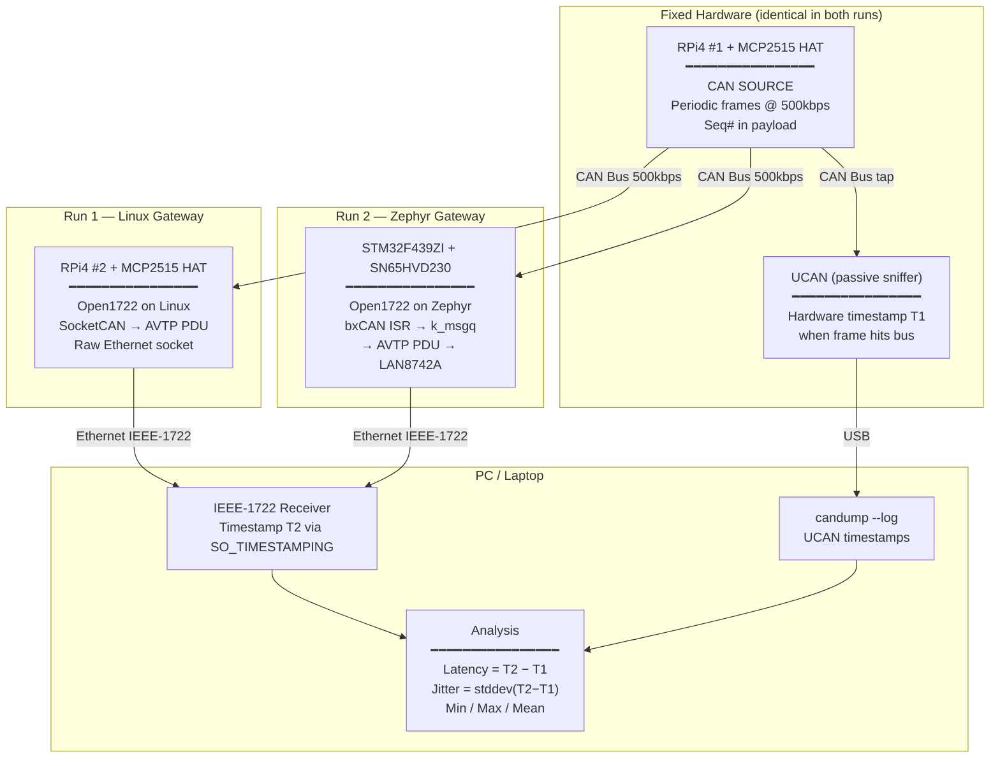

# Open1722 CAN Latency Test — Architecture Diagram

## Notes

- **RPi4 #1 and UCAN** are fixed across both runs — only the gateway node swaps.
- **T1** = UCAN hardware timestamp when the CAN frame appears on the bus.
- **T2** = PC timestamp when the IEEE-1722 Ethernet frame arrives (`SO_TIMESTAMPING`).
- **Latency** = T2 − T1 per packet; **Jitter** = stddev across N packets.
- Both runs use the same PC receiver code — only the gateway side changes.
