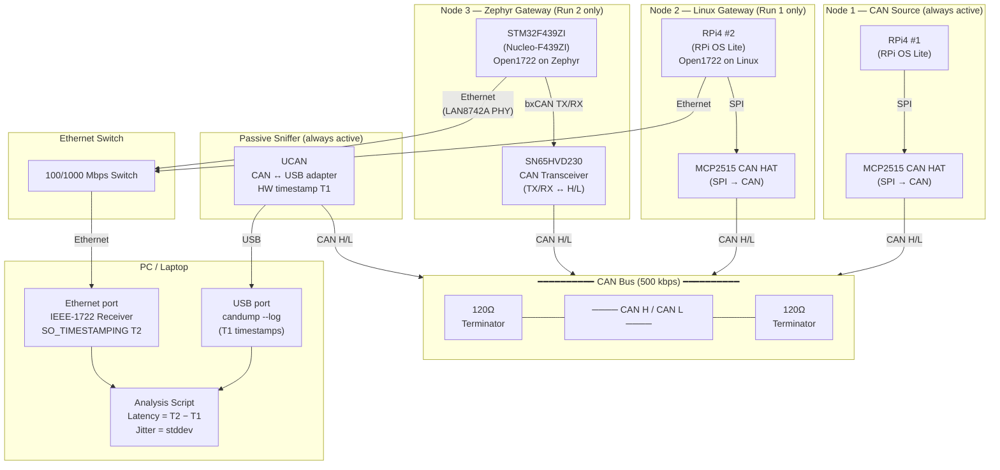

# Open1722 CAN Latency Test — Physical Connection Diagram

## Notes

- All 4 CAN nodes share the same CAN H/L wire with **120Ω terminators at both physical ends**.
- **UCAN → USB → Laptop** is always connected — it passively sniffs and records T1.
- The **Ethernet switch** connects both gateways to the laptop; only one gateway is active per run.
- **STM32** uses the onboard LAN8742A PHY via the Nucleo-F439ZI RJ45 connector.
- **RPi4 #1** connects to the CAN bus only — no Ethernet needed on the source node.
